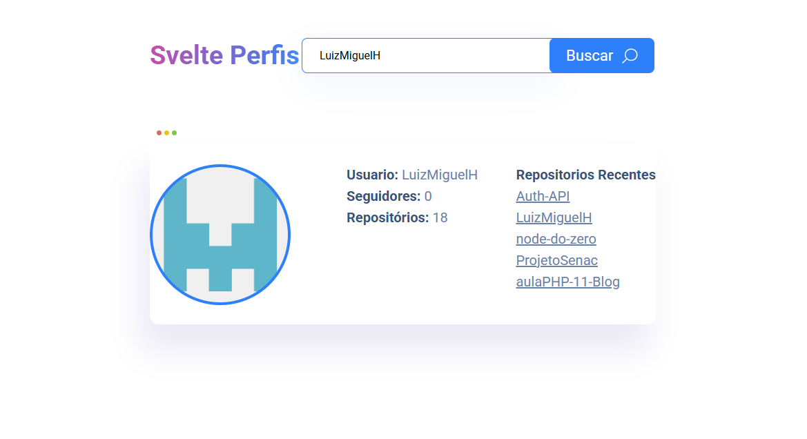

# Svelte Perfis


---
## 📌 Sobre o Projeto
Aplicação desenvolvida com Svelte e TypeScript que permite buscar usuários do GitHub e visualizar informações do perfil juntamente com seus repositórios mais recentes.
---
## 📸 Preview

---
## 🚀 Funcionalidades
- 🔎 Busca de usuários do GitHub
- 👤 Exibição de informações do perfil
- 📦 Listagem de repositórios recentes
- ⚡ Interface simples e responsiva
- 🌐 Integração com a API pública do GitHub
---
## 🛠️ Tecnologias Utilizadas
- Svelte
- TypeScript
- Node.js
---
## 📂 Estrutura do Projeto

```
src/
 ├── components/
 │    ├── BarraSuperior.svelte
 │    ├── Botao.svelte
 │    ├── Cabecalho.svelte
 │    ├── Formulario.svelte
 │    ├── Titulo.svelte
 │    └── Usuario.svelte
 │
 ├── interfaces/
 │    ├── IRepositorio.ts
 │    └── IUsuario.ts
 │
 ├── requisicoes/
 │    └── index.ts
 │
 ├── utils/
 │    └── montaUsuario.ts
 │
 ├── App.svelte
 └── main.ts
 ```
---
## ⚙️ Como Executar o Projeto
### Clone o repositório
```bash
git clone https://github.com/LuizMiguelH/svelte-perfis.git
```
### Acesse a pasta do projeto
```bash
cd svelte-perfis
```
### Instale as dependências
```bash
npm install
```
### Execute o projeto
```bash
npm run dev
```
### Abra no navegador
```
http://localhost:8080
```
---
## 🌐 API Utilizada
GitHub API:
```
https://api.github.com
```
Endpoint utilizado:
```
https://api.github.com/users/{usuario}
```
---
## 📚 Objetivo do Projeto

Este projeto foi desenvolvido com foco em estudos e prática de:

- Componentização com Svelte
- Tipagem com TypeScript
- Consumo de APIs REST
- Organização de projetos Front-end
- Manipulação de estado e propriedades
---
## 🚧 Status do Projeto

Projeto finalizado para fins de estudo e aprimoramento técnico.
---
## 👨‍💻 Autor

Luiz Miguel Haiduke